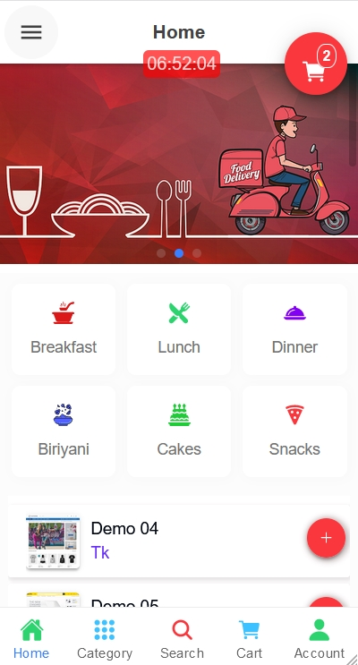
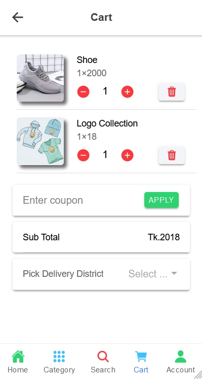
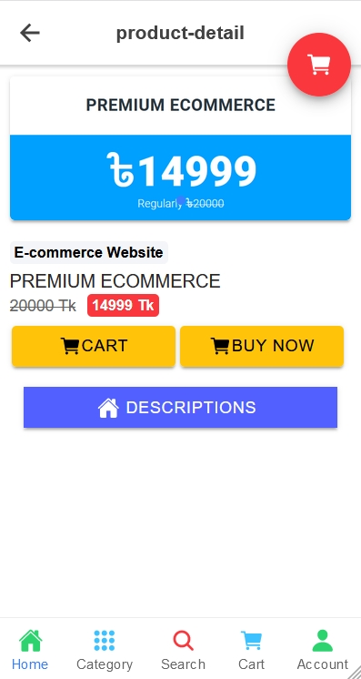

# ionic-restuarant

This is an Ionic capacitor project with angular and typescript as the frontend javascript framework. 
This app script is to integrated with wordpress woocommerce website. 
So it is too powerfull and too easy to integrate. All the woocommerce product will act as food items. 
all the admin activity can be controlled from wp-admin backend which is the most flexible part.

## Installation

Create woocommerce rest api => consumer_key and consumer_secret from woocommerce->settings->integration->rest api. select both read/write and create. 
Now go to ionic-restuarant/src/environments/environment.ts file, change everything as needed. specially set siteUrl & authUrl as your woocommerce site url, set consumerKey & authKey as woocommerce consumer_key and 
set consumerSecret & authSecret as woocommerce consumer_secret. then change yours requirements there... do the same for ionic-restuarant/src/environments/environment.prod.ts file

## Compatibility

tested upto Wordpress version 5.6.1
tested upto Woocommerce version 5.0.0

## Payment Instruction

Compatible with all woocommerce cash on delivery and bkash payment gateways for bangladesh.

## Screenshots

  
  
  
  

